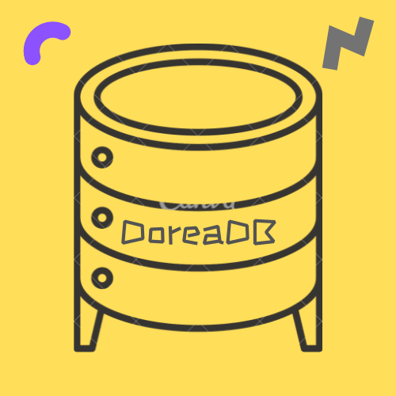

<p align="center">
    <p align="center"></p>
	<p align="center">
    <a href="https://github.com/mrxiaozhuox/Dorea/actions">
    	
    </a>
    <a href="https://github.com/mrxiaozhuox/Dorea/blob/master/LICENSE">
      
    </a>
    <a href="https://github.com/mrxiaozhuox/Dorea/blob/master/LICENSE">
			
    </a>
	</p>
	<p align="center">
    <strong>Dorea is a key-value data storage system. It is based on the Bitcask storage model</strong>
	</p>
	<p align="center">
    <a href="http://dorea.mrxzx.info/">Documentation</a> | 
    <a href="https://crates.io/crates/dorea">Crates.io</a> | 
    <a href="https://docs.rs/dorea/">API Doucment</a>
	</p>
	<p align="center">
    <a href="https://github.com/mrxiaozhuox/dorea/blob/master/README.CN.md">简体中文</a> | 
    <a href="https://github.com/mrxiaozhuox/dorea/blob/master/README.md">English</a>
	</p>
</p>

### Data Sturct

`Dorea` have the basic data type and some compound type.

- String
- Number
- Boolean
- Binary
- List \<DataValue>
- Dict \<String, DataValue>
- Tuple \<DataValue, DataValue>


## Storage Model

`dorea` based on the `Bitcask` storage model. **(Log)**

All **insert, update, delete** operations are implemented as appends.

```
key: foo | value: "bar" | timestamp: 1626470590043 # Insert Value
key: foo | value: "new" | timestamp: 1626470590043 # Update Value (append info)
key: foo | value:  none | timestamp: 1626470590043 # Remove Value (append info)
```

When a storage file reaches a maximum capacity, it is archived and a new write file is created.

## Screenshot


## Docker

```
docker pull mrxiaozhuox/dorea
```